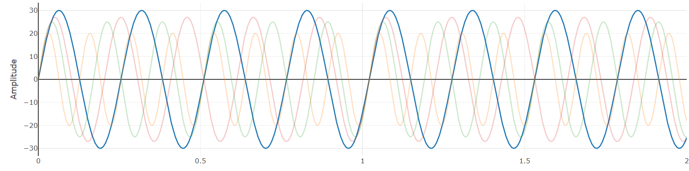

# Music_Physics
Webpage explaining the fundamental physics of music and its relationship to mathematics and neuroscience.
  

 
Visit the site <a href="https://dmccullor.github.io/Music_Physics/" target="_blank">here</a>.